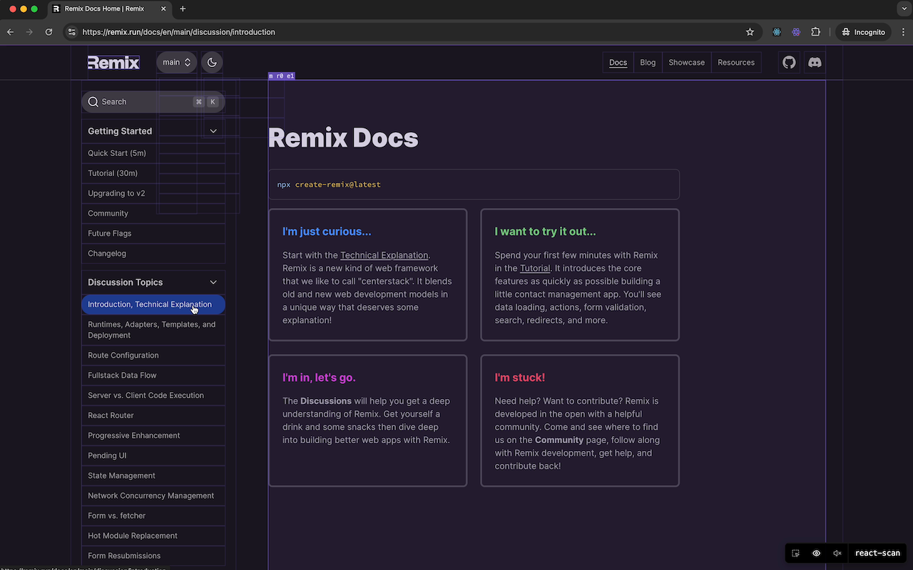

# React Scan Toggle

<div align="center">
  
</div>

A Chrome extension to easily toggle [React Scan](https://github.com/reactscan/reactscan) functionality in any React application.

> **Note**: This is not an official React Scan extension. It's a community-built tool to make React Scan more accessible.

## Screenshot

<div align="center">
  
</div>

## Features

- Toggle React Scan on/off with a single click
- Visual feedback through icon states (colored when active, gray when inactive)
- State persists while navigating within the same tab
- Secure local script injection

## Requirements

- Google Chrome or Chromium-based browser
- [React Developer Tools](https://chrome.google.com/webstore/detail/react-developer-tools/fmkadmapgofadopljbjfkapdkoienihi) extension must be installed
- For development:
  - Node.js 14 or higher
  - npm or yarn
  - librsvg (`rsvg-convert` command)
  - curl

## Installation

### From Chrome Web Store

1. Install [React Developer Tools](https://chrome.google.com/webstore/detail/react-developer-tools/fmkadmapgofadopljbjfkapdkoienihi) if you haven't already
2. Visit the [React Scan Toggle](https://chrome.google.com/webstore/detail/react-scan-toggle) in the Chrome Web Store
3. Click "Add to Chrome"
4. Confirm the installation

### Manual Installation (Development)

1. Install [React Developer Tools](https://chrome.google.com/webstore/detail/react-developer-tools/fmkadmapgofadopljbjfkapdkoienihi) if you haven't already
2. Clone this repository
3. Open Chrome and navigate to `chrome://extensions/`
4. Enable "Developer mode" in the top right
5. Click "Load unpacked" and select the `dist` folder from this repository

## Usage

1. Make sure React Developer Tools is installed and enabled
2. Click the extension icon in your Chrome toolbar to activate React Scan
3. The icon will turn from gray to colored to indicate that React Scan is active
4. Click again to deactivate

## Development

### Prerequisites

#### Installing librsvg

The `rsvg-convert` command is required for icon generation. Install it using:

```bash
# MacOS
brew install librsvg

# Ubuntu/Debian
sudo apt-get install librsvg2-bin

# Fedora
sudo dnf install librsvg2-tools

# Arch Linux
sudo pacman -S librsvg
```

### Setup

1. Clone the repository
2. Install dependencies:
   ```bash
   npm install
   ```

### Build Scripts

The project includes two main build scripts:

1. Generate PNG icons from SVG:

   ```bash
   npm run build:icons
   ```

   This converts the SVG icons to PNG in different sizes (16x16, 48x48, 128x128)

2. Update React Scan script:
   ```bash
   npm run update:react-scan
   ```
   This downloads the latest version of React Scan from unpkg

The build scripts are located in the `scripts` directory and include error handling and dependency checks.

## About React Scan

React Scan is a powerful tool for visualizing React component renders. For more information, visit the [official React Scan repository](https://github.com/reactscan/reactscan).

## Security

This extension includes the React Scan script locally instead of loading it from a CDN to ensure security and reliability.

## License

This project is licensed under the MIT License.

### React Scan License

This extension includes React Scan, which is licensed under the MIT License:

```
Copyright 2024 Aiden Bai, Million Software, Inc.

Permission is hereby granted, free of charge, to any person obtaining a copy of this software and associated documentation files (the "Software"), to deal in the Software without restriction, including without limitation the rights to use, copy, modify, merge, publish, distribute, sublicense, and/or sell copies of the Software, and to permit persons to whom the Software is furnished to do so, subject to the following conditions:

The above copyright notice and this permission notice shall be included in all copies or substantial portions of the Software.

THE SOFTWARE IS PROVIDED "AS IS", WITHOUT WARRANTY OF ANY KIND, EXPRESS OR IMPLIED, INCLUDING BUT NOT LIMITED TO THE WARRANTIES OF MERCHANTABILITY, FITNESS FOR A PARTICULAR PURPOSE AND NONINFRINGEMENT. IN NO EVENT SHALL THE AUTHORS OR COPYRIGHT HOLDERS BE LIABLE FOR ANY CLAIM, DAMAGES OR OTHER LIABILITY, WHETHER IN AN ACTION OF CONTRACT, TORT OR OTHERWISE, ARISING FROM, OUT OF OR IN CONNECTION WITH THE SOFTWARE OR THE USE OR OTHER DEALINGS IN THE SOFTWARE.
```

## Author

Created by [davidgg.es](https://davidgg.es)
